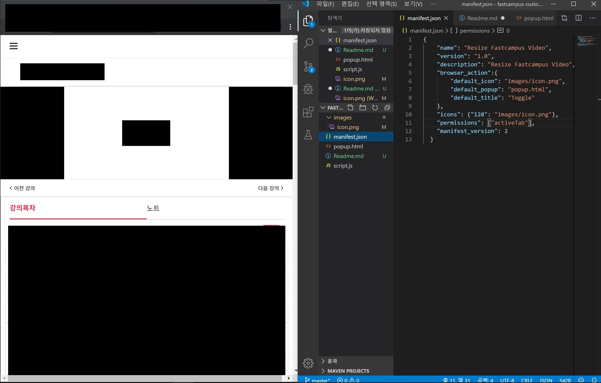
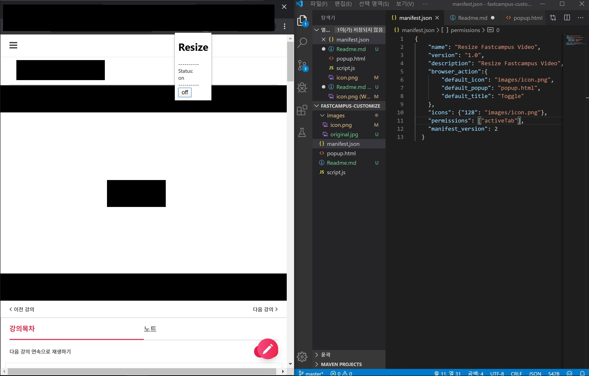

# Resize Fastcampus Video
- Fastcampus의 플레이어 크기를 변경해주는 크롬 확장 프로그램입니다.
- 좌우로 화면을 분할해 사용하는 경우 플레이어의 크기가 작아서 만들었습니다.

## 사용
- 기본적으로 Fastcampus의 플레이어는 화면 분할 사용시 아래처럼 작게 표시됩니다.

- 확장 프로그램을 설치하고 아이콘을 클릭한 후 아래쪽 버튼을 누르면 화면의 크기가 커집니다.

## 주의
- 버튼을 누르면 단순히 플레이어에 style을 추가하는 방식입니다. 다른 어떤 사이트에서도 작동하지 않고, 사이트가 변경되면 언제나 동작하지 않을 수 있습니다.